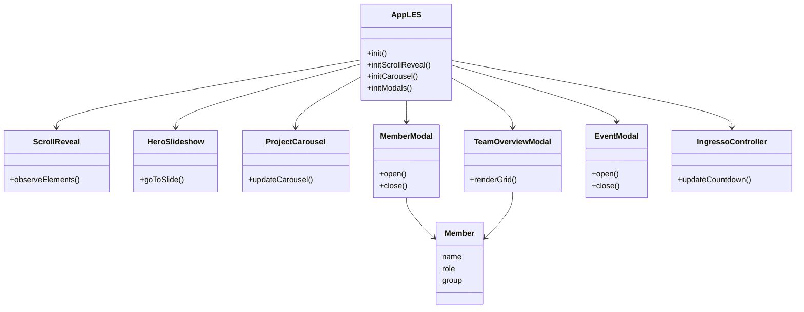
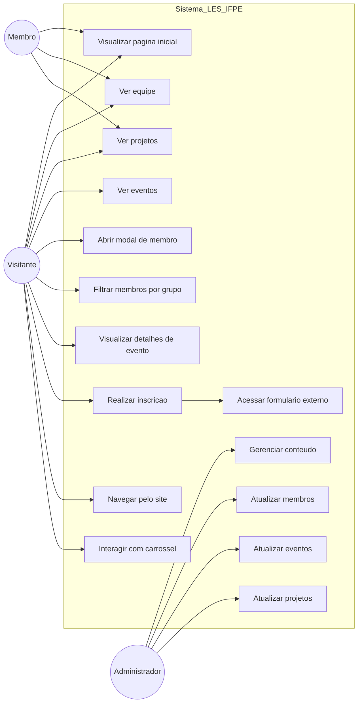

# 💻 Portal da Liga Acadêmica de Engenharia de Software (LES)

## 📌 Sobre o Projeto

O **Portal da Liga Acadêmica de Engenharia de Software (LES)** é uma plataforma web desenvolvida com o objetivo de centralizar informações, atividades e iniciativas da liga, promovendo integração entre estudantes, academia e mercado de tecnologia.

A liga acadêmica é uma organização estudantil sem fins lucrativos que visa complementar a formação dos alunos por meio de atividades de ensino, pesquisa e extensão.

### 🚧 Atualização (Agosto/26) 🚧
Atualmente o Portal se encontra em processo de MANUTENÇÃO. Para maior manutenabilidade e escalabilidade, sua arquitetura irá ser reconstruída em React + Vue, juntamente com um novo design e novas páginas de navegação. 

---

## 🎯 Objetivos

* Fortalecer a formação acadêmica em Engenharia de Software
* Promover atividades práticas e teóricas (workshops, projetos, eventos)
* Estimular inovação, colaboração e desenvolvimento tecnológico
* Aproximar estudantes do mercado de trabalho
* Desenvolver habilidades técnicas e comportamentais

---

## 🚀 Funcionalidades do Portal

* 📢 Divulgação de eventos e workshops
* 👥 Apresentação da equipe da liga
* 📚 Conteúdos educacionais e institucionais
* 🌐 Integração com redes sociais e plataformas externas
* 📱 Interface responsiva para diferentes dispositivos

---

## 🛠️ Tecnologias Utilizadas

* **HTML5** – estrutura da aplicação
* **CSS3** – estilização e responsividade
* **JavaScript (Vanilla)** – interatividade e manipulação do DOM

### 🚧 Tecnologias a serem utilizadas no NOVO portal
* **React;**
* **Vue;**
* **Integração com Firebase;**

---

## 📂 Estrutura do Projeto

```
📁 projeto
│
├── index.html
├── css/
│   └── style.css
├── js/
│   ├── script.js
│   └── scriptpage.js
└── assets/
```

---

## 📱 Responsividade

O portal foi desenvolvido com foco em responsividade, adaptando-se aos seguintes dispositivos:

* 📱 Mobile
* 📱 Tablets
* 💻 Notebooks
* 🖥️ Desktops

---

## 🧠 Sobre a Liga

A Liga Acadêmica de Engenharia de Software tem como missão integrar teoria e prática, promovendo o desenvolvimento de soluções tecnológicas e incentivando a participação ativa dos estudantes em projetos, pesquisas e eventos.

---

## 👨‍💻 Atual equipe de desenvolvimento

* **Eduarda Rocha Fernandes de Sousa**
  🔗 https://github.com/Yuriportf

* **Victor Montes da Silva**
  🔗 https://github.com/VmDevalt

* **David Willyam Felipe Marques de Oliveira**
  🔗 https://github.com/DavidOliveira2678

## 👨‍💻 Antiga equipe de desenvolvimento

* **Yuri Santos de Oliveira**
  🔗 https://github.com/Yuriportf

* **Christoph Soares Diehl**
  🔗 https://github.com/christoph-sd

* **Guilherme Nascimento F. de Barros Moraes**
  🔗 https://github.com/Guinfbm

---

## 📬 Contato

* 📸 Instagram: https://www.instagram.com/les.ifpe/
* 📧 Email: [lesifpe@gmail.com](mailto:lesifpe@gmail.com)

---

## 📄 Licença

Este projeto possui caráter acadêmico e educacional.

---


classDiagram



UML de Casos de Uso


